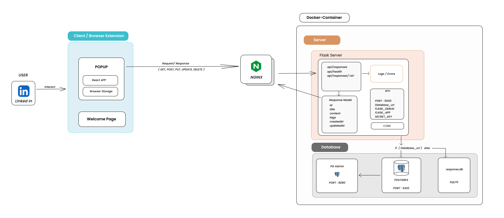

# CannerAI - AI-Powered LinkedIn & Twitter Assistant

> 🚀 A sophisticated browser extension and backend system that enhances your social media productivity with AI-powered response suggestions and seamless content management.

## ✨ Features
✨ Features
Select from a variety of pre-defined response templates

Format LinkedIn post with Ease

Full backend response management API (Flask + PostgreSQL):

Create, read, update, and delete responses via REST endpoints

Store title, content, tags (JSON), and timestamps for each response

Health check endpoint for verifying API/database status

🗄️ Backend API Endpoints
Your backend exposes these API endpoints (ready for frontend integration):

Method	Endpoint	Description
GET	/api/responses	List all responses
POST	/api/responses	Add new response (JSON body)
GET	/api/responses/<id>	View a specific response
PATCH	/api/responses/<id>	Edit response fields
DELETE	/api/responses/<id>	Delete a response
GET	/api/health	Health check/status
Sample Response Object:

json
{
  "id": "uuid-string",
  "title": "string",
  "content": "string",
  "tags": ["string", "string"],
  "created_at": "timestamp",
  "updated_at": "timestamp"
}
These endpoints are ready for integration into any frontend—connect via fetch/Axios to display, search, add, edit, and delete responses!
## 🏗 Architecture

Here’s an overview of how **Canner** works internally:

## 📄 **Contributing**

We welcome contributions! Please see our [Contributing Guide](CONTRIBUTING.md) for details.
- Join our Discord community for discussions and support. [Join Discord](https://discord.com/invite/the-cloudops-community-1030513521122885642)

## 🚀 Quick Start
A detailed Quick Start is written in our [Contributing Guide](CONTRIBUTING.md). You can go through it for more details. 

## **License**

This project is licensed under the MIT License - see the [LICENSE](LICENSE) file for details.

## 📞 **Support**

- 📧 **Email**: [baivab@techtutorialswithpiyush.com](mailto:baivab@techtutorialswithpiyush.com)
- 🐛 **Issues**: [GitHub Issues](https://github.com/piyushsachdeva/canner/issues)
- 💬 **Discord**: [Join our Discord](https://discord.com/invite/the-cloudops-community-1030513521122885642)

Made with ❤️ for developers who type the same things repeatedly
